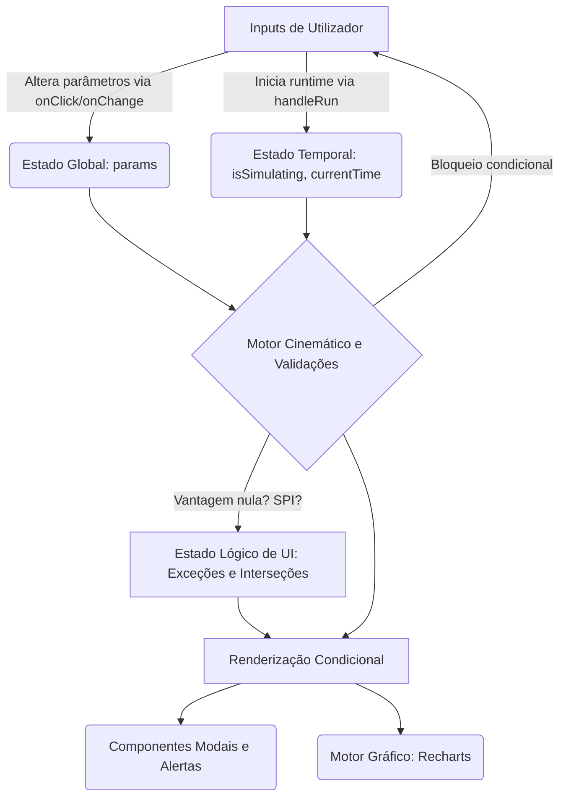

# 1. Pilha Tecnológica e Dependências Core
A aplicação baseia-se numa arquitetura puramente cliente (Frontend/SPA) suportada pelas seguintes tecnologias identificadas na infraestrutura do projeto:
- **Linguagem Principal:** TypeScript.
- **Framework Base:** React 18 (inferido pelos padrões de hooks modernos e estrutura típica Vite).
- **Ferramenta de Build:** Vite, com configuração definida em `vite.config.ts`.
- **Estilos e UI:** Tailwind CSS, utilizado através de classes de utilitários injetadas diretamente no JSX.
- **Motor de Renderização Gráfica:** Recharts (baseado em D3.js) encarregue da visualização cartesiana das funções de movimento (tag `<Line>`).
- **Iconografia:** `lucide-react`, para elementos vetoriais padrão (e.g., setas de navegação `ChevronLeft`).
- **Gestão de Pacotes:** `npm` ou `bun` (presença de `package.json`, `package-lock.json` e `bun.lock`).

# 2. Arquitetura do Componente e Gestão de Estado

### O Monólito `src/App.tsx`
A arquitetura do projeto reside num padrão extremamente centralizado onde toda a lógica de negócio (Física), estado aplicacional, handlers de exceção e a árvore de UI coexistem dentro de um único componente (`src/App.tsx`, com mais de 1100 linhas). Embora este acoplamento reduza a fricção na transferência de adereços (prop-drilling) numa fase de MVP, aumenta exponencialmente a complexidade cognitiva do ficheiro e limita a escalabilidade estrutural.

### Fluxo de Dados e Ciclo de Vida
O fluxo de dados da aplicação segue o princípio unidirecional do React (Top-Down):
1. **Origem:** Interações do utilizador nos sliders ou botões disparam setters de estado (ex.: `setParams`).
2. **Ciclo Intermédio:** Sempre que o estado de simulação é ativado (`isSimulating === true`), funções baseadas em temporizadores (sejam `useEffect` atrelados a um `setInterval` ou `requestAnimationFrame`) encarregam-se de alterar ciclicamente o iterador de tempo (`currentTime`).
3. **Consumo:** Os cálculos de colisão/interseção das funções afins espaciais reagem de forma reativa a este eixo temporal, alimentando o componente SVG do Recharts que re-renderiza o gráfico em conformidade.

### Diagrama Arquitetural de Fluxo (Mermaid)

# 3. Integrações Externas e Padrões de Rendering

### Dependência de Recursos Externos
O projeto baseia-se numa abstração cloud (Google Drive) para carregar recursos pesados, optando por não hospedar binários localmente na pasta `/public/` para otimizar a distribuição do código. 
- **Assets de Imagem:** Injetados no DOM em tags `` através de ligações de partilha do Drive (ex: `https://lh3.googleusercontent.com/d/10jYE3-FZSvrRg6bXcBsqE_zQvFr6R3GQ`). 
- **Documentos Físicos:** Redirecionamento explícito (Routing manual) usando funções `window.open(url, '_blank')` para PDFs e guiões pedagógicos hospedados externamente.

### Avaliação de Riscos e Resiliência
A utilização direta de domínios como `googleusercontent.com` expõe a infraestrutura a potenciais falhas de persistência de sessão e CORS. A base de código resolve parte das restrições estritas do carregamento destas origens com a utilização da propriedade explícita `referrerPolicy="no-referrer"` nas tags de imagem.
O grande risco técnico reside na volatilidade do recurso: caso os IDs associados no Google Drive do docente sejam apagados, tornados privados ou sobrepostos num novo ficheiro (requerendo atualização de ID como o que sucedeu no Turno T-006), o motor client-side da aplicação sofrerá degradação de conteúdo (broken links/images) sem meios para falhar graciosamente (*graceful degradation* ou assets *fallback*), resultando numa dependência infraestrutural frágil.
